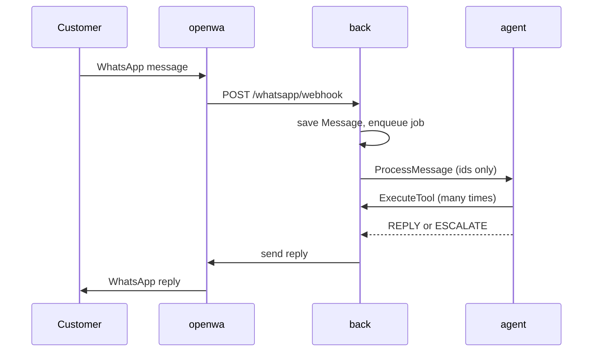

# Architecture essentials

Read this first. It takes about 10 minutes.
The full version is [architecture.md](architecture.md).
The plan for what to build next is [roadmap.md](roadmap.md).

## 1. What the product does

EcomAssistant is an AI agent on WhatsApp for Algerian online shops.
Most orders in Algeria are cash on delivery (COD). Many fail because the customer never confirmed.
The agent talks to the customer in Derdja, French or Arabic.
It confirms the order, answers questions about products, and hands hard cases to a human.

## 2. The six services

| Service | Language | What it owns | Host port |
|---|---|---|---|
| `back` | TypeScript, Express, Prisma | The API, the database, the queues, all business logic, the tools | 3000 |
| `front` | React, Vite | The merchant dashboard | 5173 |
| `agent` (`ecom_agent/`) | Python, LangGraph | The conversation: it decides what to say and which tool to call | none |
| `postgres` | PostgreSQL 16 | All data | 5432 |
| `redis` | Redis 7 | BullMQ queues, login token blacklist, OTP codes | 6379 |
| `openwa` | Node, NestJS, Baileys | The WhatsApp connection (one session per merchant) | 2785 |

Two more folders are not services.
`contracts/` holds the `.proto` files. `shared/` holds shared TypeScript types.
`landing/` is a separate marketing website.

## 3. One customer message, end to end

1. The customer writes on WhatsApp.
2. `openwa` sends a webhook to `back`: `POST /whatsapp/webhook`.
3. `back` finds the merchant from the session id, and the customer from the phone number. If the customer is unknown (no order yet), the message is ignored.
4. `back` saves a `Message` row. It transcribes voice notes and describes images first.
5. `back` puts a job in the `message` queue. A worker takes it.
6. The worker calls the agent over gRPC: `AgentService.ProcessMessage`. It sends only ids.
7. The agent reads the message row from Postgres and runs its graph.
8. When the agent needs data, it calls `back` over gRPC: `ToolService.ExecuteTool`.
9. The agent returns a decision: reply, or escalate to a human.
10. `back` saves the reply and sends it through `openwa`. On escalate, it marks the conversation as taken over and creates a dashboard notification.



## 4. One order, end to end

1. An order arrives from Shopify (`POST /store-connection/shopify/webhooks/orders`) or from `POST /orders/simulate-order`.
2. `back` saves the `Order` and links it to the conversation with `currentOrderId`.
3. `back` sends a confirmation message to the customer.
4. The customer replies. From here the flow is the same as section 3.
5. The agent calls `confirmOrder` or `cancelOrder`. `back` changes the order status.
6. The merchant ships the order from the dashboard (`POST /delivery/ship-order/:orderId`).
7. The carrier sends a webhook. `back` updates the status and tells the customer.

## 5. Repo map

```text
back/         Express API, Prisma schema, queues, workers, gRPC ToolService
front/        React dashboard
ecom_agent/   LangGraph agent, gRPC AgentService  (main work area)
contracts/    .proto files and the generated tool list (source of truth)
shared/       shared TypeScript types and the wilaya list
OpenWA/       WhatsApp bridge (vendored, v0.7.5, almost no local changes)
landing/      Next.js marketing site
docs/         this documentation
```

## 6. Run it locally

Everything in Docker:

```bash
cp .env.example .env      # fill in the secrets
docker compose up -d
# back http://localhost:3000   front http://localhost:5173
```

Change the agent code and rebuild only the agent (the agent image has no bind mount):

```bash
docker compose up -d --build agent
docker compose logs -f agent
```

This is the safest way to test the full message loop.

Agent on your laptop (only for prompt and graph work):

```bash
docker compose up -d postgres redis back
cd ecom_agent
uv venv --python 3.12 && source .venv/bin/activate
uv pip install -r requirements.txt
python -m server
```

Warning: this mode does not run the full loop.
- The gRPC ports 50051 and 50052 are not published to the host. Your laptop agent cannot call `ToolService`, so every tool call fails.
- `back` runs in Docker and calls `agent:50052`. That name does not exist for a process on your laptop, so `back` cannot reach it either.
- It is fine for testing the graph up to the point where a tool is needed.
- To make the loop work you must publish 50051 and route `back` to your laptop. Do this only in a local `docker-compose.override.yml` that you never commit, and never publish these ports on a server. This setup is not tested in the repo.

There are three env files and they are not the same:
- root `.env` is read by Docker Compose for every service.
- `ecom_agent/.env` is read only when you run the agent outside Docker.
- `back/.env` is read only when you run `back` outside Docker.
Outside Docker, use `127.0.0.1` and not the names `postgres`, `redis`, `back`. Only Postgres (5432) is published for this.

## 7. Seven rules you must not break

1. **The conversation row decides who the customer is.**
   `ToolService` reads `merchantId` and `customerId` from the `Conversation` row.
   It never trusts the ids the agent sends. This keeps merchants apart.
2. **Every database query is scoped by `merchantId`.**
   If you load or change a row by an `id` that came from a request and you do not also check `merchantId`, you have a bug. (`delivery.service.ts::createParcel` has this bug today.)
3. **The agent has no business logic.**
   It decides. `back` acts. New rules about orders, prices or stock go in `back`.
4. **The `.proto` files are the contract.**
   Change a `.proto`, then run `ecom_agent/scripts/gen_stubs.sh`, then commit both together.
5. **Tools are defined in `back` first.**
   After you change a tool, run the export script and commit `contracts/src/generated/tools.json`. The Python side must match by hand today.
6. **Never trust the customer's text.**
   It goes to an LLM. Do not let the LLM pick ids or amounts that `back` can compute itself.
7. **Never commit secrets or customer data.**
   Keep `.env` files out of git. Do not put customer files in `uploads/`.

## 8. Known dangers today

These are real. Read [PROJECT_REPORT.md](PROJECT_REPORT.md) before you deploy anything.
- Two routes have no login: `/orders/simulate-order` and `/messages/fake-messages`.
- The WhatsApp webhook signature check is off in development mode.
- Compose publishes Postgres, Redis, Prisma Studio and the OpenWA admin API to the host.
- Agent memory is in RAM. A restart forgets every conversation.

## 9. What to read next

| You want to... | Read |
|---|---|
| Understand everything | [architecture.md](architecture.md) |
| Pick a task | [roadmap.md](roadmap.md) |
| Know the gRPC rules | [grpc-contract.md](grpc-contract.md) |
| See how the gRPC split was built | [architecture-roadmap.md](architecture-roadmap.md) |
| Know what is broken | [PROJECT_REPORT.md](PROJECT_REPORT.md) |
