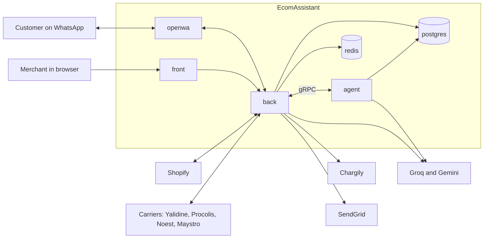
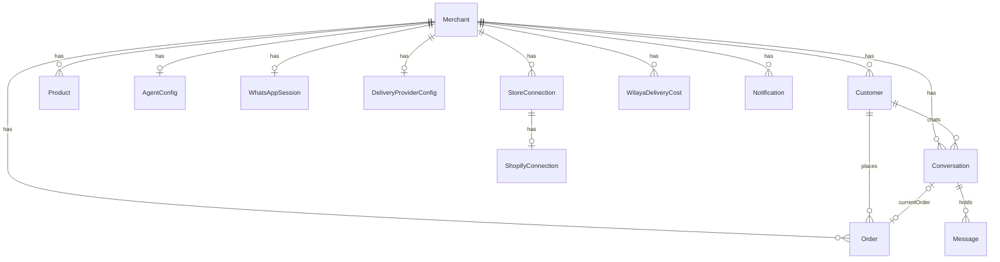
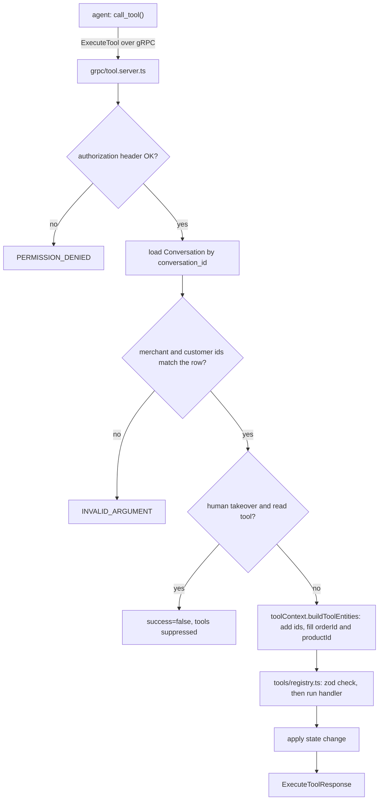
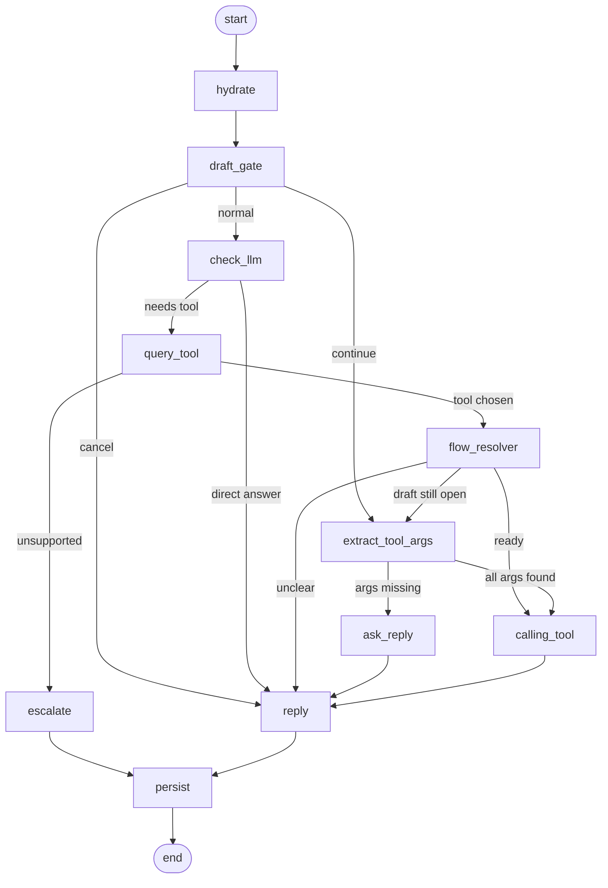
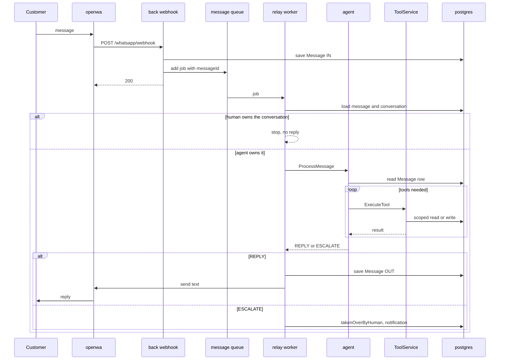
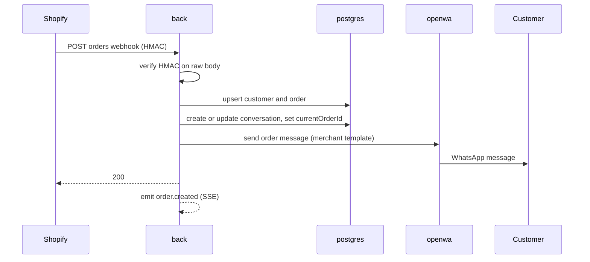

# Architecture

This is the full reference for how EcomAssistant is built today.
It describes the code as it is, including the parts that are weak.
For a short version, read [architecture-essentials.md](architecture-essentials.md).
For what to build next, read [roadmap.md](roadmap.md).
For the list of bugs and risks, read [PROJECT_REPORT.md](PROJECT_REPORT.md).

File paths are relative to the repo root. Facts were checked against the code on branch `feat/agent`.

## Contents

1. [Scope](#1-scope)
2. [System context](#2-system-context)
3. [Services and runtime](#3-services-and-runtime)
4. [Backend (`back/`)](#4-backend-back)
5. [The WhatsApp channel](#5-the-whatsapp-channel)
6. [The agent (`ecom_agent/`)](#6-the-agent-ecom_agent)
7. [The gRPC boundary](#7-the-grpc-boundary)
8. [Main flows](#8-main-flows)
9. [Frontend (`front/`)](#9-frontend-front)
10. [`shared/`, `contracts/`, `landing/`](#10-shared-contracts-landing)
11. [Configuration](#11-configuration)
12. [Cross-cutting concerns](#12-cross-cutting-concerns)
13. [Known gaps](#13-known-gaps)
14. [Glossary](#14-glossary)

---

## 1. Scope

**The product.** A SaaS for Algerian online merchants. Each merchant connects a Shopify store and a WhatsApp number. An AI agent then talks to the merchant's customers.

**The agent does:**
- confirm or cancel cash on delivery (COD) orders,
- answer product questions from the synced catalog,
- give delivery prices by wilaya,
- send hard cases to a human.

**Languages.** Derdja, French and Arabic for customers. The dashboard is in French, English and Arabic.

**Multi-tenant.** One deployment serves many merchants. Every row in the database belongs to a `merchantId`.

**What is built and what is not.** The message loop works end to end. Confirmation messages are sent. Human takeover works as an on/off switch. Follow-ups, the conversation inbox, real billing and the KPI dashboard are not built. See [section 13](#13-known-gaps).

---

## 2. System context

Notes:
- `back` also calls Gemini. It uses it for voice transcription, image captions, and two catalog tools (`searchProducts`, `suggestProducts`).
- The agent reads Postgres directly, but only one table (`Message`), with raw SQL (`ecom_agent/db.py`).
- The agent does not call `openwa`. Only `back` talks to WhatsApp.

---

## 3. Services and runtime

Defined in `docker-compose.yml`.

| Service | Image or build | Host ports | Depends on | Healthcheck |
|---|---|---|---|---|
| `postgres` | `postgres:16.15-alpine` | 5432 | none | `pg_isready` |
| `redis` | `redis:7.4.7-alpine`, append-only file on | 6379 | none | `redis-cli ping` |
| `back` | `back/Dockerfile` (Node 22) | 3000, 5555 | postgres, redis (healthy) | none |
| `agent` | `ecom_agent/Dockerfile` (Python 3.12) | none | postgres, redis (healthy), back (started) | gRPC `Health` call every 30 s |
| `front` | `front/Dockerfile` (Node 22) | 5173 | back | none |
| `openwa` | `OpenWA/Dockerfile` | 2785 | none | HTTP `/api/health/ready` |

Facts to know:
- The gRPC ports 50051 (`back`) and 50052 (`agent`) are not published. Only containers on the Compose network reach them.
- `back` and `front` mount the whole repo as `/app`. Code changes reload without a rebuild. This also puts `.env` files inside the containers.
- `back` runs `prisma db push` at every start, then `tsx watch`. The `front` container runs the Vite dev server. There are no production images yet.
- The `agent` image copies its code in. It has no bind mount, so you rebuild after a change.
- Because 50051 and 50052 are not published, an agent run outside Docker cannot use tools, and `back` cannot reach it. See the local run notes in [architecture-essentials.md](architecture-essentials.md#6-run-it-locally).
- Volumes: `postgres_data`, `redis_data`, `openwa_data` (WhatsApp session credentials live here).
- Port 5555 is published for Prisma Studio, but nothing starts Studio.

---

## 4. Backend (`back/`)

### 4.1 Stack

Node 22, Express 4, TypeScript, Prisma 5 on Postgres, BullMQ 5 on Redis, `@grpc/grpc-js`, zod, pino, passport (Google), bcrypt, SendGrid.
It runs with `tsx`. Tests use the built-in `node:test` runner.

### 4.2 Boot sequence (`back/src/index.ts`)

1. `app.ts` builds the Express app.
2. The three workers are imported. Importing them starts them: `email.worker`, `relay.worker`, `order.worker`.
3. `app.listen(PORT)`. `PORT` comes from `process.env.PORT`, default 3000. `config.port` (from `API_PORT`) is defined but nothing uses it, so setting `API_PORT` has no effect.
4. `startToolServer()` starts the gRPC `ToolService` on `0.0.0.0:50051`. A failure here is logged and does not stop the API.

`email.worker.ts` throws at import if the SendGrid key is missing. So the API cannot start without it.

### 4.3 HTTP pipeline (`back/src/app.ts`)

In this order:
1. `cors()` with no options (allows any origin).
2. `express.json()`. It also keeps the raw bytes in `req.rawBody`, which webhook checks need. The default 100 KB body limit still applies.
3. `cookie-parser`.
4. `passport.initialize()`.
5. `csrfProtection` (see 4.5).
6. `/api-docs` and `/api-docs.json` (Swagger, public).
7. `GET /health`.
8. `/uploads` as static files, no login.
9. The API router (`routes/index.ts`).
10. An error handler that returns `err.message`.

Express 4 does not catch errors thrown inside `async` handlers. Handlers without their own `try/catch` can crash the process.

### 4.4 Route map

Mounted in `back/src/routes/index.ts`. "Auth" means the `authenticate` middleware.

| Prefix | Module | Main routes | Auth |
|---|---|---|---|
| `/auth` | `modules/auth` | `signup`, `verify-email`, `login`, `refresh`, `forgot-password`, `reset-password`, `logout`, `logout-all`, `me`, `google` | mixed |
| `/orders` | `modules/orders` | `GET /`, `GET /ids`, `PATCH /bulk-status`, `/bulk-hold`, `/bulk-tracking`, `POST /simulate-order` | all except `simulate-order` |
| `/store-connection` | `modules/storeConnections` | `GET /status`, then `/shopify/*`: OAuth, order and product webhooks, sync, settings | mixed |
| `/whatsapp` | `modules/whatsapp` | `POST /webhook`, session create, pairing code, reconnect, disconnect, status, `GET /events` (SSE), notifications | all except `webhook` |
| `/agent-config` | `modules/agent-config` | `GET /`, `PUT /`, `POST /activate` | yes |
| `/products` | `modules/products` | `GET /`, `GET /ids`, `PATCH /bulk-agent` | yes |
| `/customers` | `modules/customers` | `GET /`, `GET /ids`, `PATCH /bulk-block` | yes |
| `/escalations` | `modules/escalations` | `GET /`, `POST /:id/resolve`, `POST /resolve-all` | yes |
| `/messages` | `modules/fakeMessages` | `POST /fake-messages` | none |
| `/billing` | `modules/billing` | `POST /checkout`, `GET /webhook`, `GET /payment/success`, `GET /payment/failure` | `checkout` only |
| `/delivery` | `modules/delivery` | `status`, `providers`, `config`, `connect`, `disconnect`, `ship-order/:orderId`, `parcels`, `tracking/:number`, `POST /webhook/:provider` | all except `webhook` |

Each module follows the same layout: `*.routes.ts` (paths and middleware), `*.controller.ts` (HTTP), `*.service.ts` (logic and Prisma).
Lists use cursor pagination (`types/pagination.types.ts`).

### 4.5 Authentication and security middleware

- **Tokens.** `login` sets an access token in an `accessToken` cookie (httpOnly, `sameSite: strict`). The `authenticate` middleware also accepts `Authorization: Bearer`. A refresh token cookie is scoped to `/auth`. Refresh tokens are kept in Redis.
- **Revocation.** `authenticate` checks two Redis keys: `jwt-blacklist:<jti>` (one token) and `revoke-before:<merchantId>` (all tokens issued before a time). It then checks that the merchant still exists.
- **CSRF.** Double submit. The server sets a readable `csrf-token` cookie. The browser sends it back in `X-CSRF-Token`. The check runs on non-GET requests that carry an access cookie. The paths `/whatsapp/webhook` and `/delivery/webhook` are skipped.
- **Rate limits.** `express-rate-limit` on signup (5), login (10) and OTP routes (10), each per 15 minutes per IP. `trust proxy` is not set.
- **Sign-up.** Email and password, then a 6-digit code sent by email (queue `email`). Google OAuth is also available.
- **Validation.** `validate(schema, "body" | "query")` with zod schemas from `validators/`.

### 4.6 Queues and workers

| Queue | Producer | Worker | What it does | Attempts |
|---|---|---|---|---|
| `message` | WhatsApp webhook, fake messages | `relay.worker.ts` (concurrency 5) | Calls the agent for one message (see section 8.1) | 5, backoff 1 s exponential |
| `order-confirmation` | `orders.service.ts::ingestOrder` | `order.worker.ts` (concurrency 5) | Sends the confirmation text for an order | 3, backoff 2 s exponential |
| `email` | auth service | `email.worker.ts` | Sends verification and reset emails | with backoff |

Queue names and options are in `back/src/queues/`.
There is no follow-up queue and no delayed job anywhere.

### 4.7 Events and live updates

`back/src/events/eventBus.ts` is a plain in-process `EventEmitter`.
`GET /whatsapp/events` is a Server-Sent Events stream for the logged-in merchant. It pushes `session.status`, `notification`, `order.created` and `product.synced`.
Because the emitter lives in one process, this only works with one `back` instance.

### 4.8 Data model (`back/prisma/schema.prisma`)

15 models and 7 enums. Postgres.

| Model | Purpose |
|---|---|
| `Merchant` | The account. Email, password hash, shop name, Google id, verified flag. |
| `StoreConnection`, `ShopifyConnection` | The link to the shop: source, domain, encrypted token. |
| `AgentConfig` | Per-merchant settings: language, tone, follow-up delays, templates, `isActive`. |
| `Product` | Synced catalog item. Price, currency, stock status, category, variants, and an `agentEnabled` flag. |
| `Customer` | A buyer. Unique on `(merchantId, phone)`. Has `waJid`, `language`, `blocked`, wilaya, commune. |
| `Order` | A COD order. Product snapshot, quantity, totals, delivery cost, status, tracking number. |
| `Conversation` | One per `(merchantId, customerId)`. Holds `state`, `currentOrderId`, `currentProductId`, `takenOverByHuman`, `escalatedAt`, `memory`. |
| `Message` | One WhatsApp message. Direction `IN` or `OUT`, sender `CUSTOMER`, `AI` or `MERCHANT`, text, media fields. |
| `WilayaDeliveryCost` | Delivery price per wilaya per merchant. |
| `WhatsAppSession` | One OpenWA session per merchant: session id, status, phone number. |
| `DeliveryProviderConfig` | The merchant's carrier and credentials. One per merchant. |
| `Notification` | Dashboard notifications (escalations, disconnects). |
| `Commune` | Reference list of communes. |
| `SuggestedIntent` | Unused. |

State enums:
- `OrderStatus`: `PENDING`, `CONFIRMED`, `SHIPPED`, `DELIVERED`, `CANCELLED`.
- `ConversationState`: `IDLE`, `GREETING`, `PRODUCT_DISCOVERY`, `PRODUCT_SELECTED`, `WAITING_CONFIRMATION`, `CONFIRMED`, `SHIPPING`, `FINISHED`, `CANCELLED`.
- `ConversationStatus`: `ACTIVE`, `RESOLVED`.

Several columns exist but nothing writes or reads them (for example `Message.intent`, `Message.whatsappMessageId`, `Conversation.followUpStep`, `Conversation.memory`, most of `AgentConfig`). See the report.
Migrations are in `back/prisma/migrations/`. The column `Customer.waJid` has no migration. `db push` hides this.

### 4.9 The tool layer

The agent has no database access to business data. It calls **tools**. The backend owns them.

Key files:
- `back/src/grpc/tool.server.ts`: the gRPC server, auth, identity checks, takeover gate, logging.
- `back/src/modules/ai/tools/registry.ts`: the 11 handlers. Each one is a function of explicit arguments.
- `back/src/modules/ai/schemas/intents.schemas.ts`: zod schema per tool, and the read/write split.
- `back/src/modules/ai/toolContext.ts`: adds `merchantId`, `customerId`, `conversationId`. Fills `orderId` from `Conversation.currentOrderId` and `productId` from `currentProductId` when the agent leaves them out.
- `back/src/modules/ai/conversationState.ts`: which tool moves the conversation to which state.
- `back/src/modules/ai/tools/toolMeta.ts`: the text descriptions that go to the agent.

The 11 tools:

| Kind | Tools |
|---|---|
| Read (6) | `searchProducts`, `selectProduct`, `getProductDetails`, `suggestProducts`, `calculateShipping`, `getOrderStatus` |
| Write (5) | `createOrder`, `confirmOrder`, `modifyOrder`, `cancelOrder`, `escalateConversation` |

Rules the layer enforces:
- Identity comes from the `Conversation` row, not from the agent.
- Order tools filter by `id`, `merchantId` and `customerId`. A customer cannot touch another customer's order.
- Read tools change the conversation state after they succeed (search moves it to `PRODUCT_DISCOVERY`, select moves it to `PRODUCT_SELECTED`). Write tools change state inside the handler.
- While a human owns the conversation, read tools are refused and write tools still run.
- `escalateConversation` sets `takenOverByHuman` and `escalatedAt`, and creates a notification. Calling it twice does nothing the second time.
- Delivery cost is found by wilaya **name**, ignoring case. If no row matches, `calculateShipping` returns "not found". `createOrder` and `ingestOrder` instead use a cost of 0 and log a warning.

### 4.10 Store connections (Shopify)

- Pattern: `AbstractStoreConnection`, `ShopifyConnection`, `StoreConnectionFactory` in `back/src/connections/`. A WooCommerce case is commented out.
- Connect: `GET /store-connection/shopify/authenticate` starts OAuth with a random nonce. `GET .../callback` finishes it.
- The access token is encrypted with `lib/crypto.ts`. **The key is hardcoded in that file today.**
- Webhooks from Shopify go to `/store-connection/shopify/webhooks/orders` and `/products`. Both check the Shopify HMAC on `req.rawBody`.
- On a new order, `ShopifyConnection.upsertOrders` saves the order. The controller then calls `sendOrderNotification`, which creates or updates the conversation and sends a confirmation message. It also emits `order.created`.
- Catalog sync: `sync-all` and `sync-orders`.

### 4.11 Delivery

- Pattern: `AbstractDeliveryProvider` with four drivers (`Yalidine`, `Procolis`, `Noest`, `Maystro`), created by `ProviderFactory`.
- A merchant connects one carrier with an id and token. `connect()` tests the credentials first. They are stored in `DeliveryProviderConfig`. **They are stored in plain text today.**
- `POST /delivery/ship-order/:orderId` builds a parcel from the order and calls the carrier. The tracking number is saved on the order.
- `POST /delivery/webhook/:provider` receives carrier events. It tries each connected merchant of that provider, parses the event, updates the order status, and sends a WhatsApp message on `shipped` and `delivered`.
- Nothing calls `shipOrder` when an order is confirmed. Shipping is manual.

### 4.12 Billing

`modules/billing` has one working route, `POST /checkout`, which creates a Chargily checkout for a plan. `config/plans.ts` lists three plans (Base 10 000, Max 30 000, Entreprise 100 000 DZD).
There is no subscription model, no trial, no plan limits, and the webhook handler only logs. It is registered as `GET`, but Chargily sends `POST`.

### 4.13 Media

- OpenWA sends media inline in the webhook as base64.
- `whatsapp.controller.ts` writes it to `/app/uploads/media/<conversationId>-<timestamp>.<ext>`.
- Voice notes go to `modules/ai/media/transcription.service.ts` (Gemini). Images go to `imageCaption.service.ts` (Gemini).
- The result is stored in `Message.text`. The agent only ever reads text.
- `/uploads` is served with no login.

### 4.14 Logging and tests

- pino is set up in `lib/logger.ts` and used only for gRPC logs. Everything else uses `console.log`.
- Tests: 7 files run by `npm test`. They cover the agent bridge, contract parity, conversation state, queue options, suggestion helpers, tool schemas and reply delivery.
- `back/scripts/grpc-check.ts` is an end-to-end gRPC check you run by hand. `e2e-message.ts` simulates one inbound message.

---

## 5. The WhatsApp channel

### 5.1 OpenWA

`OpenWA/` is a third-party bridge (v0.7.5), vendored into the repo. It has two small local changes (a message-store key fix and a Node image pin).
In this project it runs with `ENGINE_TYPE=baileys`. Baileys is an unofficial WhatsApp Web client. There is no Chromium.
Compose sets `QUEUE_ENABLED=false`, `ALLOW_DEV_API_KEY=true`, `SSRF_ALLOWED_HOSTS=back` and `RESOLVE_LID_TO_PHONE=true`.

### 5.2 One session per merchant

- `WhatsAppSession` has a unique `merchantId` and a unique `sessionId`.
- `POST /whatsapp/session` creates an OpenWA session, waits up to 30 s for a QR code, and registers the webhook `http://back:3000/whatsapp/webhook` for `message.received`, `message.sent` and `session.status`.
- The dashboard shows the QR and polls status. A pairing-code route exists but has no screen.
- All merchants use one OpenWA admin key (`OPENWA_API_KEY`).
- Sessions do not restart by themselves after `openwa` restarts (`AUTO_START_SESSIONS` is off).

### 5.3 Inbound

`whatsapp.controller.ts::handleWebhook`:
1. Check the signature (skipped when `NODE_ENV=development`, which is the default).
2. Find the `WhatsAppSession` by `sessionId`. Unknown session: ignore.
3. Find the sender's phone. If the sender is a WhatsApp LID, try to resolve it to a phone.
4. Find the conversation for that customer.
   - Known phone: use the existing customer.
   - LID sender: find by `waJid`, or create a customer with a placeholder phone.
   - Unknown phone: ignore the message. A customer must exist first, from an order.
5. Save media to disk. Map the WhatsApp type to `text`, `voice` or `image`.
6. Create the `Message` row (`IN`, `CUSTOMER`) and update `lastMessageAt`.
7. For voice, transcribe. For images, caption. Update the row.
8. Enqueue a `message` job.

Not handled: groups and messages from the merchant's own number are not filtered out. Video, documents, locations and reactions become a placeholder or empty text.
There is no deduplication. OpenWA's idempotency key and message id are ignored.

### 5.4 Outbound

`modules/whatsapp/reply.service.ts::deliverAssistantReply`:
1. If a human owns the conversation, stop. Nothing is saved or sent.
2. Save each reply as an `OUT`, `AI` message row.
3. If the merchant's session is `connected` or `ready`, send the texts one by one with a typing indicator (`whatsapp.service.ts::sendMessagesSequentially`).
4. Any send error is logged and swallowed. The row already says "sent".

The target is the real phone number (`<phone>@c.us`). Only a customer with a placeholder phone falls back to the LID id.

---

## 6. The agent (`ecom_agent/`)

### 6.1 Stack

Python 3.12, LangGraph 1.2, LangChain, `langchain-groq`, `langchain-google-genai`, gRPC (`grpcio` 1.66), `psycopg` 3, pydantic 2.
The Docker image runs as a non-root user. `entrypoint.sh` runs `python -m server`.
No tests, no linter, no type checker are configured.

### 6.2 Process

`server.py` starts a gRPC server with 10 threads on `0.0.0.0:50052`. It has two RPCs.
- `Health`: no auth. It always says `SERVING`.
- `ProcessMessage(message_id, conversation_id, merchant_id, customer_id)`: checks the bearer key, then:
  1. Loads the `Message` row with `db.py::get_message`.
  2. If the message is not from a customer, or has no text, it replies with a fixed greeting.
  3. Otherwise it runs the graph with `thread_id = conversation_id`, inside `tool_identity(...)`.
  4. It takes the last AI message of this turn (after the latest customer message) as the reply. If the graph raised an error, or produced no reply, it answers `DECISION_ESCALATE`.

### 6.3 The graph (`graph.py`, `routing.py`, `nodes/`)

What each node does:

| Node | File | Job |
|---|---|---|
| `hydrate` | `nodes/memory.py` | Resets per-turn fields. Loads saved memory from the store. |
| `draft_gate` | `nodes/draft.py` | If a tool call is half filled, decides: continue it, cancel it, or start something new. Uses regex first, then an LLM. |
| `check_llm` | `nodes/check.py` | Classifies the message: answer directly, or use a tool. |
| `query_tool` | `nodes/query.py` | Picks one tool. Has a fast path for "buy" words that picks `createOrder`. May decide to escalate. |
| `flow_resolver` | `nodes/flow.py` | Decides which flow the tool applies to: continue one, create one, or ask the customer to clarify. |
| `extract_tool_args` | `nodes/draft.py` | Asks the LLM to pull arguments (and the delivery address) out of the customer's text. Marks the draft `ready` when nothing is missing. |
| `ask_reply` | `nodes/draft.py` | Writes a question for the missing arguments. |
| `calling_tool` | `nodes/calling.py` | Runs the tool through LangGraph's `ToolNode`. Stores product results in the flow. |
| `reply` | `nodes/reply.py` | Writes the answer from the tool result, or uses the direct answer. |
| `escalate` | `nodes/reply.py` | Calls `escalateConversation`. Produces no text. |
| `persist` | `nodes/memory.py` | Saves the conversation memory in the store. |

Code around the nodes:

| Path | Holds |
|---|---|
| `routing.py` | Every router: `route`, `draft_route`, `after_extract`, `query_escalate_route`, `flow_route`. |
| `prompts/` | Every prompt, one file per node. `common.py` has the JSON schema hint and the fixed fallback texts. |
| `flows.py` | Memory helpers: active flow and draft, selected product, address prerequisites, shipping sync. |
| `text/` | Regexes (`patterns.py`), message text helpers (`messages.py`), JSON extraction (`json_parse.py`). |
| `llm/structured.py` | `call_json`, `ask_json_dict`, `llm_phrase`: the ways nodes call the LLM. |
| `tools/schema.py` | Reads a tool's args schema: required fields, type casting, missing fields. |

### 6.4 State and memory

- `AgentState` (`models/state.py`): messages, chosen tool, tool output, flags.
- `ConversationMemory` (`models/conversation.py`): a `GlobalInformation` (name, wilaya, commune, address) and a list of `Flow` objects.
- A `Flow` (`models/domain.py`) is one topic in the chat, such as "looking at product X". It holds product discovery results, an optional order context, shipping info and a `ToolCallDraft`.
- A `ToolCallDraft` collects the arguments for one tool over several turns. Status: `drafting`, `ready`, `executed`, `cancelled`.
- Storage: LangGraph `InMemorySaver` (chat history) and `InMemoryStore` (memory). **Both live in RAM only.** A restart loses everything.
- The Prisma column `Conversation.memory` is not used by the agent.

### 6.5 LLM client (`llm/client.py`)

- Providers come from `LLM_PROVIDER` (default `groq,gemini`). Groq uses `openai/gpt-oss-120b`. Gemini uses `gemini-2.5-flash`. Temperature is 0.
- `LLMClient.invoke` tries each provider in order and moves on at any exception.
- The graph asks for JSON in the prompt and parses it by hand (`llm/structured.py::call_json`, up to two tries per call).
- A turn can make up to seven sequential LLM calls.
- No timeouts or retry limits are set on the models.

### 6.6 Tools (`tools/`)

- `tools/registry.py` declares the 11 tools as LangChain tools. Each one calls `tools/grpc.py::call_tool`.
- `call_tool` reads the conversation identity from a context variable set by `tool_identity(...)` in `server.py`. It sends `ExecuteTool` with the bearer key.
- Recoverable results (not found, takeover) come back as a JSON string. Hard errors raise `ToolCallError`.
- `tool_client.py` is a second, unused client.

### 6.7 What the agent does not do

- It does not know the merchant: no shop name, tone or default language. `AgentConfig` is never loaded.
- It only sees text. `back` turns voice notes into a transcript and images into a caption before the agent runs. The agent cannot look at an image or match it to the catalog. A message with no text at all, such as a shared location, gets the fixed greeting.
- It does not start conversations. It only answers inbound messages.
- It does not follow up.
- It does not check that `AgentConfig.isActive` is true. Nothing on the message path checks it either.

---

## 7. The gRPC boundary

Two services, defined in `contracts/proto/`.

| Service | Proto | Served by | Called by | Address |
|---|---|---|---|---|
| `AgentService` | `agent/v1/agent.proto` | agent | back | `agent:50052` |
| `ToolService` | `tools/v1/tool.proto` | back | agent | `back:50051` |

- **Auth.** Every RPC except `AgentService.Health` needs `authorization: Bearer <INTERNAL_API_KEY>`. Both sides use one shared key. Both sides fall back to `dev-internal-key` when it is missing.
- **Transport.** Plain text (insecure channels). Safe only because the ports stay on the Compose network.
- **Codegen.** The Python side uses generated stubs in `ecom_agent/grpc_gen/`, committed to git. The TypeScript side loads the `.proto` files at runtime with `@grpc/proto-loader`, so it has no generated code. See [grpc-ts-loading.md](grpc-ts-loading.md).
- **Regenerate.** After a `.proto` change run `ecom_agent/scripts/gen_stubs.sh`. Commit the `.proto` and `grpc_gen/` together.
- **Payloads.** `ProcessMessageRequest` has only four ids. The agent reads the message text from Postgres itself. `ExecuteTool` sends and returns JSON strings.
- **Decisions.** `DECISION_REPLY` and `DECISION_ESCALATE` are used. `DECISION_UNAVAILABLE` exists, and `back` treats it like escalate, but the agent never sends it.
- **Deadlines.** None are set on either side.
- **Tool list.** `contracts/src/generated/tools.json` is generated from the backend registry by `back/scripts/export-contract.ts`. `back` has a test that fails if it drifts. The Python tool definitions are a hand copy and no test covers them.

Full rules: [grpc-contract.md](grpc-contract.md), [contracts/README.md](../contracts/README.md).

---

## 8. Main flows

### 8.1 Inbound customer message

If the agent call fails, the job is retried up to 5 times. After that the job is dropped and the customer gets no answer.

### 8.2 Order created (Shopify)

For simulated orders (`POST /orders/simulate-order`), `ingestOrder` does the same work, then sets the conversation state to `WAITING_CONFIRMATION` and queues an `order-confirmation` job. That job sends a fixed three-message text in Derdja, French or Arabic (`orderConfirmation.templates.ts`).
The two paths use different texts. Only the simulated path sets the state.

### 8.3 Customer confirms or cancels

1. The customer replies "yes" or "cancel". This is the normal flow of 8.1.
2. The agent picks `confirmOrder` or `cancelOrder`.
3. `back` fills `orderId` from `Conversation.currentOrderId` if the agent did not send it.
4. The handler changes the order status and moves the conversation to `CONFIRMED` or `CANCELLED`.
5. The agent writes the reply.

The agent's own tool definitions mark `orderId` as required. This can make it ask the customer for an id that the backend already knows.
Confirming an order does not create a shipment.

### 8.4 Escalation

Escalation happens in three ways:
- The agent picks `escalateConversation` (nothing else fits).
- The agent graph fails, or produces no text. `ProcessMessage` answers `DECISION_ESCALATE`.
- The merchant puts a conversation on hold (`PATCH /orders/bulk-hold`). This sets only `takenOverByHuman`.

On escalation `back` sets `takenOverByHuman=true` and `escalatedAt`, and creates a `Notification`. The customer receives no message.
The merchant sees it in the dashboard (Escalations page and notifications), then answers from their own phone. `POST /escalations/:id/resolve` marks it resolved.

### 8.5 Delivery status

1. The merchant connects a carrier and calls `POST /delivery/ship-order/:orderId`.
2. `back` creates the parcel and stores the tracking number.
3. The carrier calls `POST /delivery/webhook/<provider>`.
4. `back` maps the event to `SHIPPED`, `DELIVERED` or `CANCELLED`, updates the order, and messages the customer for `shipped` and `delivered`.

Three of the four drivers do not verify the webhook signature.

---

## 9. Frontend (`front/`)

### 9.1 Stack

React 18, Vite 5, TypeScript, Tailwind 3, `react-router-dom` 6, `i18next` (French, English, Arabic), `sonner` for toasts, `lucide-react` icons.
There is no UI library and no state library. State is React context.

### 9.2 Routes (`front/src/App.tsx`)

| Path | Page | Notes |
|---|---|---|
| `/login`, `/signup` | auth pages | Sign-up leads to email code verification |
| `/onboarding/store` | Shopify connect | WooCommerce card only moves to the next step |
| `/onboarding/whatsapp` | QR pairing | |
| `/onboarding/agent` | agent settings | |
| `/onboarding/activate` | activation | |
| `/dashboard` | home | Uses fake data |
| `/dashboard/orders` | orders table | Filters, bulk status, hold agent, ship |
| `/dashboard/customers` | customers | Bulk block |
| `/dashboard/catalog` | products | Toggle agent per product |
| `/dashboard/escalations` | escalations | Links to `wa.me` to reply from a phone |
| `/dashboard/settings` | settings | Tabs: agent, store, WhatsApp, wilaya prices (placeholder), delivery |
| `/dashboard/billing` | billing | Empty page |
| `/dashboard/notifications`, `/dashboard/profile` | | |

There is no conversation inbox. A route to `/forgot-password` is linked but does not exist.

### 9.3 How it talks to the backend

- `front/src/lib/api.ts` uses `fetch` with `credentials: 'include'` and an empty base URL. All calls are relative paths.
- In development, Vite proxies each API prefix to `back` (`front/vite.config.ts`). The committed target is `http://back:3000`, which works inside the Docker `front` container. On a laptop outside Docker it must be `http://localhost:3000`, so the target should come from an env variable.
- On a non-GET request it reads the `csrf-token` cookie and sends `X-CSRF-Token`.
- On `401` it calls `POST /auth/refresh` once, shared between parallel requests, then retries. If that fails it raises an `auth:expired` event.
- Tokens are never in JavaScript. Only a small `user` object is kept in `localStorage`.
- `lib/notifications.tsx` opens the SSE stream at `/whatsapp/events`.
- `lib/auth.tsx` falls back to a fake dev login when the backend is down. This is a bug (see the report).

### 9.4 i18n

Locale files: `front/src/i18n/locales/{fr,en,ar}/*.json`, 13 files each, same keys. Some texts are still hardcoded in French. Arabic is selectable but the layout is not right-to-left.

---

## 10. `shared/`, `contracts/`, `landing/`

**`shared/`** (`@ecomassistant/shared`): TypeScript source consumed directly by workspace packages. Contains the 58-wilaya list (`WILAYAS`, `getWilayaCode`), delivery provider metadata, and zod schemas and types. Only the wilaya and provider helpers are imported anywhere. The types have drifted from the Prisma enums.

**`contracts/`** (`@ecomassistant/contracts`): the `.proto` files, the tool name list, and `src/generated/tools.json`. It is the single source of truth for the back-to-agent contract. Rules are in [contracts/README.md](../contracts/README.md).

**`landing/`**: a separate Next.js 16 and React 19 marketing site with Tailwind 4 and its own npm lockfile. It is not part of the pnpm workspace. It shows prices that do not match `back/src/config/plans.ts`.

**Workspace.** `pnpm-workspace.yaml` lists `back`, `front`, `shared`, `contracts`. `OpenWA/` and `landing/` are separate apps with their own `package-lock.json`.

---

## 11. Configuration

There are three kinds of env file, and they are not interchangeable.

| File | Read by | When |
|---|---|---|
| root `.env` (from `.env.example`) | Docker Compose (`env_file:`) for every service | Always with Compose |
| `back/.env` | `back` when run with `pnpm dev` outside Docker | Local dev |
| `ecom_agent/.env` | `ecom_agent/config.py` | Agent outside Docker only |

Compose does not read `back/.env` or `ecom_agent/.env`. Inside the `back` container the bind mount still shows `back/.env`, but `dotenv` does not overwrite variables that Compose already set, so the root `.env` wins.

Variables by owner:

| Group | Variables | Read by |
|---|---|---|
| Database | `POSTGRES_*`, `DATABASE_URL` | postgres, back, agent |
| Redis | `REDIS_URL`, `REDIS_HOST` | back |
| Auth | `JWT_SECRET`, `JWT_EXPIRES_IN`, `REFRESH_TOKEN_TTL`, `GOOGLE_*` | back |
| Internal gRPC | `INTERNAL_API_KEY` | back and agent (must match) |
| gRPC addresses | `AGENT_GRPC_ADDR` (back to agent), `TOOLS_GRPC_ADDR` (back bind), `BACK_TOOLS_GRPC_ADDR` (agent to back), `TOOLS_GRPC_ENABLED` | back and agent |
| WhatsApp | `OPENWA_URL`, `OPENWA_API_KEY`, `OPENWA_WEBHOOK_SECRET`, `INTERNAL_URL` | back |
| LLM (agent) | `LLM_PROVIDER`, `GROQ_API_KEY`, `GROQ_MODEL`, `GOOGLE_API_KEY`, `GEMINI_MODEL` | agent |
| LLM (back) | `GEMINI_API_KEY_1..6` | back media and catalog tools |
| Shopify | `SHOPIFY_API_KEY`, `SHOPIFY_API_SECRET`, `SHOPIFY_SCOPES` | back |
| Billing | `CHARGILY_*` | back |
| Email | `EMAIL_PROVIDER_API_KEY`, `EMAIL_FROM` | back |
| Tracing | `LANGSMITH_API_KEY`, `LANGSMITH_PROJECT` | agent (tracing is not switched on) |

`back/src/config/index.ts` throws at start if a required variable is missing. These have no fallback: `DATABASE_URL`, `JWT_SECRET`, `JWT_EXPIRES_IN`, `CHARGILY_BASE_URL`, `CHARGILY_PUBLIC_KEY`, `CHARGILY_PRIVATE_KEY`, `GOOGLE_CLIENT_ID`, `GOOGLE_CLIENT_SECRET`. The email worker also needs `EMAIL_PROVIDER_API_KEY` and `EMAIL_FROM`, and the Gemini client needs at least one Gemini key. So `back` cannot start without payment, Google, email and Gemini settings, even for local work.
It has silent fallbacks for `OPENWA_API_KEY`, `OPENWA_WEBHOOK_SECRET` and `INTERNAL_API_KEY`, and `NODE_ENV` defaults to `development`.
`.env.example` still lists `MESSAGE_HANDLER`, which no code reads.

---

## 12. Cross-cutting concerns

### 12.1 Multi-tenancy

- Every business table has `merchantId`.
- HTTP routes take the merchant from the login token (`req.merchant.merchantId`).
- gRPC tools take it from the `Conversation` row.
- WhatsApp webhooks take it from the `WhatsAppSession` row.
- Known holes: `delivery.service.ts::createParcel` updates an order by `id` only. `POST /delivery/webhook/:provider` searches across merchants. The two no-login routes accept any `merchantId`.

### 12.2 Security model today

Good:
- httpOnly, same-site strict cookies, double-submit CSRF, revocation in Redis.
- Shopify OAuth nonce and HMAC checks.
- Tool identity comes from the database row.
- Non-root user in the agent image.

Weak (details in the report):
- Hardcoded encryption key, plain text carrier credentials.
- Webhook signature bypass in development mode, wrong header name.
- Public `dev-admin-key` on OpenWA, published database and cache ports.
- Public `/uploads`. Secrets and phone numbers in logs.
- No `helmet`, open CORS, no request timeout.

### 12.3 Reliability

- Queue jobs retry with backoff, but there is no deduplication and no order per conversation. Two fast messages from one customer can be processed at the same time.
- No deadline on the agent call. A slow model holds a worker.
- Agent memory is RAM only.
- The webhook does slow work (transcription) before it answers OpenWA.
- Outbound sends have no retry.

### 12.4 Observability

- `back`: `console.log` almost everywhere. pino for gRPC only.
- `agent`: Python `logging` at INFO. The full state and message text are logged.
- No metrics, no tracing, no error reporting. LangSmith keys exist but tracing is off.
- Health: `GET /health` on `back`, gRPC `Health` on the agent. Neither checks its dependencies.

### 12.5 Testing and delivery

- `back` has 7 test files. `front`, `shared`, `contracts` have none.
- `ecom_agent` has evals in `ecom_agent/evals/`, not unit tests. They run test
  conversations through the graph with a fake shop instead of `back` (they swap
  `tools.registry.call_tool`), then score each case with code-only checks as a
  LangSmith experiment.
  - Run: from `ecom_agent/`, `python -m evals.run` (all cases) or
    `python -m evals.run --cases 6,7`.
  - No-LLM self test: `python -m evals.selfcheck`.
  - One turn costs about 3.4K tokens. The free Groq tier allows 8K tokens per
    minute and 200K per day, so `--pause` (default 30 s) waits before each turn.
  - A row with `llm_clean = 0` hit an LLM provider failure. Don't trust its
    other scores.
- `lint` scripts are `echo 'lint ok'`.
- No CI. No GitHub Actions.
- Git: `dev` is the default branch and `main` is for releases. Work goes in `feat/<name>` and `fix/<name>` branches and merges to `dev` by pull request.

---

## 13. Known gaps

Grouped by what they block.

| Gap | Evidence | Where to look |
|---|---|---|
| Unsafe to expose to a network | no-login routes, webhook bypass, open ports, hardcoded key | [PROJECT_REPORT.md](PROJECT_REPORT.md) |
| No conversation inbox or in-app takeover | no `/conversations` routes, no page | [roadmap.md](roadmap.md) |
| Agent ignores merchant settings and the active switch | `AgentConfig` never loaded, `isActive` not checked | [roadmap.md](roadmap.md) and the report |
| No follow-ups | `followUpDelays` stored, no queue | [roadmap.md](roadmap.md) |
| Confirmed orders are not shipped | `confirmOrder` only changes status | [roadmap.md](roadmap.md) |
| Delivery price table cannot be edited | placeholder tab, no routes | [roadmap.md](roadmap.md) |
| Memory and messages are not durable or idempotent | RAM store, no dedupe, no deadline | [PROJECT_REPORT.md](PROJECT_REPORT.md) |
| Not deployable | dev-mode images, `db push`, no CI, no tests | [PROJECT_REPORT.md](PROJECT_REPORT.md) |
| The agent cannot match a product photo to the catalog | back only writes a text caption | [roadmap.md](roadmap.md) |
| Real billing, KPIs, WooCommerce, official WhatsApp API | stubs and placeholders | [roadmap.md](roadmap.md) |

---

## 14. Glossary

| Term | Meaning |
|---|---|
| COD | Cash on delivery. The customer pays the driver. |
| Wilaya | An Algerian province. There are 58. |
| Commune | A town inside a wilaya. |
| Derdja / Darija | Algerian Arabic. Often written in Latin letters, mixed with French. |
| Merchant | Our customer. The shop owner. |
| Customer | The shop's buyer. The person on WhatsApp. |
| Conversation | One chat per merchant and customer. |
| Takeover | A human owns the conversation. The agent stays silent. |
| Escalation | The agent hands the conversation to a human. It turns takeover on. |
| Tool | A backend function the agent can call, such as `createOrder`. |
| Flow | One topic in a chat, in the agent's memory. |
| Draft | A tool call whose arguments are still being collected. |
| Thread id | The LangGraph key for one conversation's history. It equals the conversation id. |
| JID | A WhatsApp address, for example `2137...@c.us`. |
| LID | A privacy id WhatsApp uses instead of a phone number in some chats. |
| OpenWA | The WhatsApp bridge service. |
| Baileys | The WhatsApp Web library OpenWA uses here. Unofficial. |
| BullMQ | The job queue library on Redis. |
| gRPC | The typed call protocol between `back` and the agent. |
| Proto | The `.proto` file that defines gRPC messages and services. |
| LangGraph | The Python library that runs the agent as a graph of steps. |
